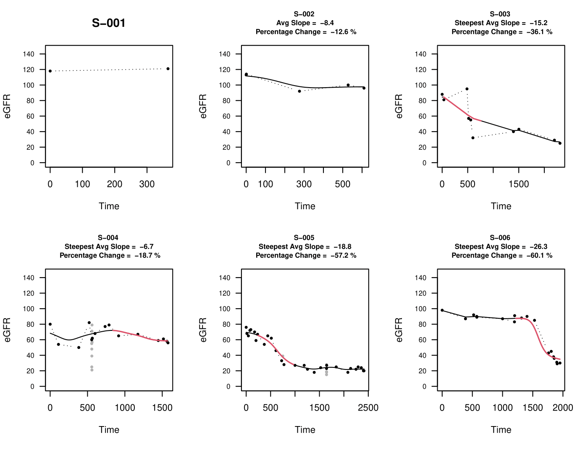
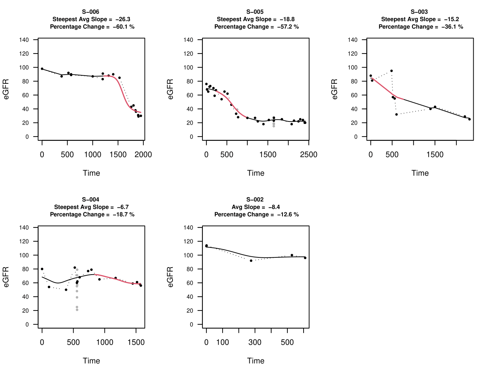
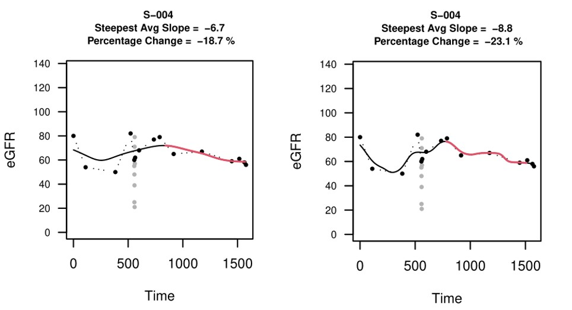
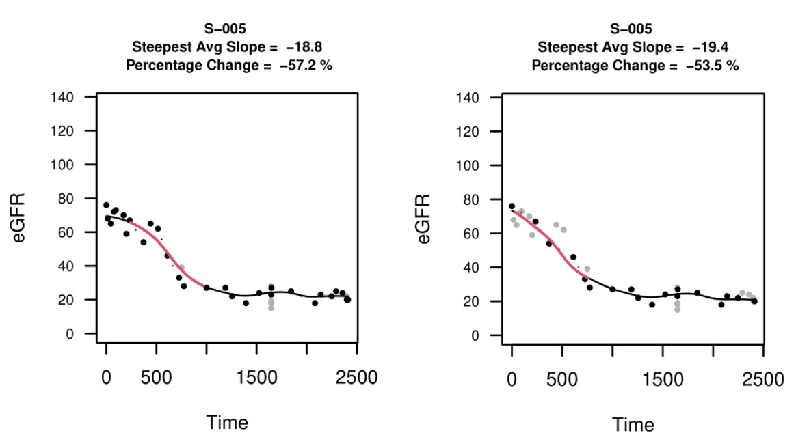
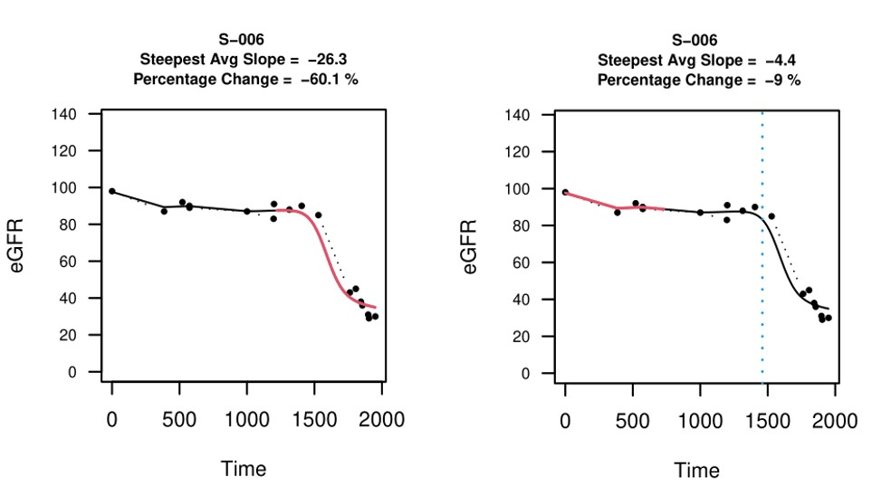

<!-- README.md is generated from README.Rmd. Please edit that file -->

## eGFRsmooth : Smoothing eGFR trajectories

eGFRsmooth is an R package designed to smooth estimated Glomerular
Filtration Rate (eGFR) trajectories. Data points are smoothed with a
Gaussian kernel and the slope and percentage change of eGFR for each
subject are calculated. eGFRsmooth returns a table summarizing eGFR
statistics and outputs plots of smooth trajectories for each subject.

## Contents

  - [Installation](#installation)
  - [Quick Start](#quick-start)
      - [Input Data](#input-data)
      - [Running eGFRsmooth with default
        parameters](#running-egfrsmooth-with-default-parameters)
      - [Interpreting output](#interpreting-output)
      - [Fine-tuning parameters](#fine-tuning-parameters)
  - [Release History](#release-history)

## Installation

eGFRsmooth can be installed from GitHub with:

``` r
library("devtools")
devtools::install_github("jleechung/eGFRsmooth")
```

## Quick Start

eGFRsmooth parses time-series eGFR data and smooths data points with a
Gaussian Kernel. After trajectories are calculated, eGFRsmooth computes
the slope and percentage change for each trajectory in a “sliding
window” fashion. Below is a guide to running eGFRsmooth.

### Input Data

eGFRsmooth takes as input a data frame with three mandatory columns. The
names of these columns must match all of **Subject**, **eGFR**, and
**Date**. Date values can be both numeric (with each unit representing a
day) or in the DD/MM/YYYY format. Examples of simulated input data with
the two different date formats are included with the package. The two
data sets are otherwise equivalent and can be loaded as follows:

``` r
library(eGFRsmooth)

## From tab-delimited text file
data <- read.delim(system.file("extdata/eGFRdata.txt", package = "eGFRsmooth"))
head(data)
#>   Subject eGFR Date
#> 1   S-001  118   24
#> 2   S-001  121  389
#> 3   S-002  113   13
#> 4   S-002  114   14
#> 5   S-002   92  289
#> 6   S-002  100  541

## From csv
data <- read.csv(system.file("extdata/eGFRdata.csv", package = "eGFRsmooth"))
head(data)
#>   Subject eGFR      Date
#> 1   S-001  118 15/1/1998
#> 2   S-001  121 15/1/1999
#> 3   S-002  113  4/1/1998
#> 4   S-002  114  5/1/1998
#> 5   S-002   92 7/10/1998
#> 6   S-002  100 16/6/1999
```

### Running eGFRsmooth with default parameters

After reading the input data file, several parameters need to be
declared.

  - `k.width`: Smoothing bandwidth parameter in days. Larger bandwidths
    produce smoother curves. Defaults to `150` days.  
  - `w.width`: The size of the sliding window for which the steepest
    average slope will be calculated in years. Defaults to `2` years.
  - `min.width`: The minimum follow-up time for which the slope will be
    calculated (in cases where follow-up is shorter than the sliding
    window width specified above) in years. Defaults to `1` year.  
  - `thres.acute`: This argument filters data points which are not at
    least `thres.acute` days clear of the data points adjacent to it.
    Defaults to `30` days. This filters data points associated with
    hospitalization events, where data points are dense and exhibit
    large variance.  
  - `max.range`: The slope for each subject will be calculated within
    the first `max.range` years for each subject. Defaults to `NA`,
    i.e., the full trajectory will be used.  
  - `sort.param`: The variable to sort the output by. eGFRsmooth outputs
    plots that can be ordered by different criteria, corresponding to
    different values of the character parameter `sort.param`. The
    possible values are described in depth in the following section.
    Defaults to `Percentage.Drop`.
  - `decreasing`: The logical parameter `decreasing` controls whether
    the sorting is done in ascending or descending order based on the
    chosen sorting parameters. Defaults to `FALSE`.
  - `output.dir`: A character value describing where the output plots
    and table should be written to. Defaults to `NULL`, where files are
    written to a directory `output/` in the present working directory.

<!-- end list -->

``` r
## Run with default parameters
result <- eGFRsmooth(data)
#> [1] "Generating unsorted eGFR statistics and plots..."
#> [1] "Generating results table..."
#> [1] "Generating sorted plots..."
```

### Interpreting output

`eGFRsmooth` returns a dataframe summarizing 10 variables for each
subject. Additionally, it writes out this dataframe to a text output in
the user-defined output directory `output.dir`.

``` r
head(result)
#> # A tibble: 6 x 11
#>   Subject  Slope Percentage.Drop eGFR.Baseline eGFR.Window.Sta~ eGFR.Window.End
#>   <chr>    <dbl>           <dbl>         <dbl>            <dbl>           <dbl>
#> 1 S-001    NA               NA             118             NA              NA  
#> 2 S-002    -8.42           -12.6           113            112.             97.6
#> 3 S-003   -15.2            -36.1            88             84.4            53.9
#> 4 S-004    -6.73           -18.7            80             71.9            58.5
#> 5 S-005   -18.8            -57.2            76             65.7            28.1
#> 6 S-006   -26.3            -60.1            98             87.5            34.9
#> # ... with 5 more variables: Observations.Total <dbl>, Observations.Used <dbl>,
#> #   Time.Range <dbl>, Time.Window.Start <dbl>, Time.Window.End <dbl>
```

`sort.param` can take any of these variables as its value. The variables
are described in depth below:

  - **Slope**: The steepest slope calculated in the window in most
    cases. In cases where the trajectory is shorter than the window
    width `w.width`, the average slope is calculated and reported.  
  - **Percentage.Drop**: Percentage change in eGFR between start and end
    of window.  
  - **eGFR.Baseline**: eGFR at the first time point.  
  - **eGFR.Window.Start**: eGFR at the start of the window.  
  - **eGFR.Window.End**: eGFR at the end of the window.  
  - **Observations.Total**: Total number of observations in the
    trajectory.  
  - **Observations.Used**: Total number of observations used in slope
    calculation.  
  - **Time.Range**: Time range of the whole trajectory.  
  - **Time.Window.Start**: Time at the start of the window.  
  - **Time.Window.End**: Time at the end of the window.

`eGFRsmooth` also outputs two pdf documents corresponding to sorted and
unsorted plots of the trajectories for each subject. 9 plots are drawn
on each page in a 3x3 grid. Below are the plots from `unsorted.pdf`
returned from the run with the example data set with six subjects.



eGFRsmooth plot output for each subject depends on the range and the
number of data points corresponding to the subject’s trajectory.

**Case 1:**  
If the subject’s follow-up has less than 4 data points or the range of
the trajectory is shorter than `min.width` (defaults to 1 year), the
data is not smoothed. Subject S-001 is an example of this case.

**Case 2:**  
If the subject’s follow-up has at least 4 data points and the range of
the trajectory is longer than `min.width` but shorter than window width
`w.width` (defaults to 2 years), the data is smoothed, and the whole
trajectory is used to calculate the slope. This is reported as the
average slope. Subject S-002 is an example of this case.

**Case 3:**  
For subjects with at least 4 data points in their follow-up and a
trajectory longer than `w.width`, the data is smoothed. The steepest
part of the trajectory of width `w.width` is identified and the steepest
slope is calculated based on this interval. This interval is highlighted
in red. This is the case with subjects S-003 to S-006.

The second pdf `sorted.pdf` corresponds to sorted plots based on
`sort.param`. Subjects whose trajectories are not smoothed (i.e. Case 1
subjects) are removed from this analysis. Below is an example of the
plots sorted by `Percentage.Drop` (default), with S-001 removed.



### Fine-tuning parameters

In this section, we show how users can vary input parameter values to
fine-tune smoothing and describe how the output varies with each change.

**k.width**

`k.width` (the smoothing bandwidth) controls how smoothed out each
continuous trajectory is. By default, `k.width` is set to 150 days.
Larger values of `k.width` mean that the trajectories are more smoothed
out. The plot on the right shows the output with `k.width = 75`, and
shows a trajectory that is perhaps over-fitted to the data points. Users
can fine-tune smoothing with `k.width` based on the data set.



**thres.acute**

`thres.acute` controls data point density by removing points without at
least `thres.acute` days of clearance from both its neighbours. This
ensures that dense regions of data points (usually associated with
hospitalization events) exhibiting large fluctuations do not
significantly influence the final smoothed trajectory. Such an event
seems to occur with subject S-005 around 1600 days after the first time
point. The points removed are coloured in light grey, and are not used
in smoothing and calculation of the slope. By default, `thres.acute` is
set to 30 days (left). The plot on the right shows the output with
`thres.acute = 100`.



**max.range**

`max.range` restricts the interval of the trajectory for which the
steepest slope should be calculated from. With `max.range = NA` (left),
the whole trajectory is searched to find the interval with the steepest
slope. The plot on the right shows the output with `max.range = 4`
(years). The steepest slope interval search is restricted to the first 4
years, in this case significantly influencing the steepest slope and
percentage change calculated for S-006.



## Release History

**Initial Package Release 0.1.0**

Release date: 1st August 2020
